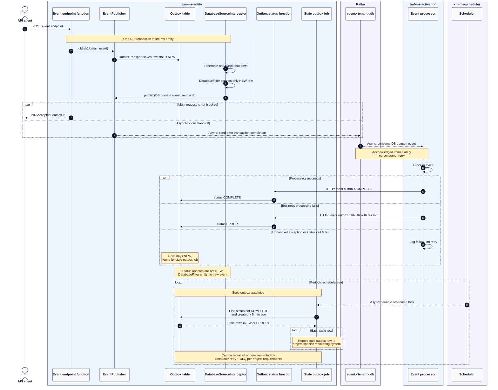

# XM Transactional outbox implementation example

More details about pattern: Transactional outbox could be found by:
[link](https://microservices.io/patterns/data/transactional-outbox.html)

```mermaid
---
config:
  theme: base
  themeVariables:
    background: "#ffffff"
    fontFamily: "GitLab Sans, Inter, Arial, sans-serif"
    fontSize: "18px"
    primaryColor: "#f8fafc"
    primaryTextColor: "#0f172a"
    primaryBorderColor: "#334155"
    secondaryColor: "#eff6ff"
    secondaryTextColor: "#0f172a"
    secondaryBorderColor: "#334155"
    tertiaryColor: "#f5f3ff"
    tertiaryTextColor: "#0f172a"
    tertiaryBorderColor: "#334155"
    lineColor: "#334155"
    textColor: "#0f172a"
    actorBkg: "#f8fafc"
    actorBorder: "#334155"
    actorTextColor: "#0f172a"
    actorLineColor: "#64748b"
    signalColor: "#0f172a"
    signalTextColor: "#0f172a"
    labelBoxBkgColor: "#ffffff"
    labelBoxBorderColor: "#475569"
    labelTextColor: "#0f172a"
    loopTextColor: "#0f172a"
    noteBkgColor: "#fef3c7"
    noteBorderColor: "#92400e"
    noteTextColor: "#451a03"
    sequenceNumberColor: "#ffffff"
  sequence:
    actorFontFamily: "GitLab Sans, Inter, Arial, sans-serif"
    actorFontSize: 18
    actorFontWeight: 600
    noteFontFamily: "GitLab Sans, Inter, Arial, sans-serif"
    noteFontSize: 18
    noteFontWeight: 500
    messageFontFamily: "GitLab Sans, Inter, Arial, sans-serif"
    messageFontSize: 18
    messageFontWeight: 500
---
sequenceDiagram
    accTitle: Transactional outbox pattern from event endpoint to activation processing
    accDescr: An entity event endpoint stores a NEW outbox row, the DB domain event reaches activation through Kafka asynchronously, activation acknowledges immediately and marks the outbox COMPLETE or ERROR through entity, and a scheduled job reports stale outbox rows to a project-specific monitoring system.

    autonumber
    actor Client as API client
    box rgb(239, 246, 255) xm-ms-entity
        participant Fn as Event endpoint function
        participant Pub as EventPublisher
        participant Outbox as Outbox table
        participant DBI as DatabaseSourceInterceptor
        participant Status as Outbox status function
        participant Job as Stale outbox job
    end
    box rgb(245, 243, 255) Kafka
        participant Topic as event.<tenant>.db
    end
    box rgb(239, 246, 255) tmf-ms-activation
        participant Act as Event processor
    end
    box rgb(245, 243, 255) xm-ms-scheduler
        participant Sched as Scheduler
    end

    Client->>Fn: POST event endpoint

    rect rgb(235, 245, 255)
        Note over Fn,DBI: One DB transaction in xm-ms-entity
        Fn->>Pub: publish(domain event)
        Pub->>Outbox: OutboxTransport saves row status NEW
        DBI->>DBI: Hibernate onSave(outbox row)
        DBI->>DBI: DatabaseFilter accepts only NEW row
        DBI->>Pub: publish(DB domain event, source db)
    end

    par Main request is not blocked
        Fn-->>Client: 202 Accepted, outbox id
    and Asynchronous hand-off
        Pub-->>Topic: Async: send after transaction completion
    end

    Topic-->>Act: Async: consume DB domain event
    Note over Topic,Act: Acknowledged immediately,<br/>no consumer retry

    Act->>Act: Process event
    alt Processing succeeds
        Act->>Status: HTTP: mark outbox COMPLETE
        Status->>Outbox: status COMPLETE
    else Business processing fails
        Act->>Status: HTTP: mark outbox ERROR with reason
        Status->>Outbox: status ERROR
    else Unhandled exception or status call fails
        Act->>Act: Log failure, no retry
        Note over Outbox: Row stays NEW,<br/>found by stale outbox job
    end
    Note over DBI,Outbox: Status updates are not NEW,<br/>DatabaseFilter emits no new event

    loop Periodic scheduler run
        Note over Outbox,Job: Stale outbox watchdog
        Sched-->>Job: Async: periodic scheduled task
        Job->>Outbox: Find status not COMPLETE<br/>and created > 5 min ago
        Outbox-->>Job: Stale rows (NEW or ERROR)
        loop Each stale row
            Note over Job: Report stale outbox row to<br/>project-specific monitoring system
        end
        Note over Outbox,Job: Can be replaced or complemented by<br/>consumer retry + DLQ per project requirements
    end
```
